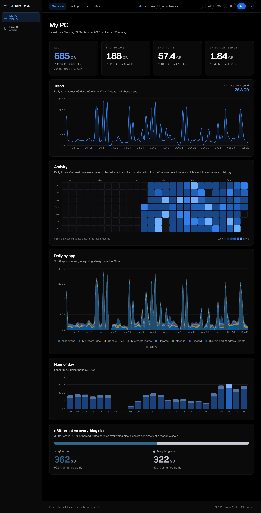
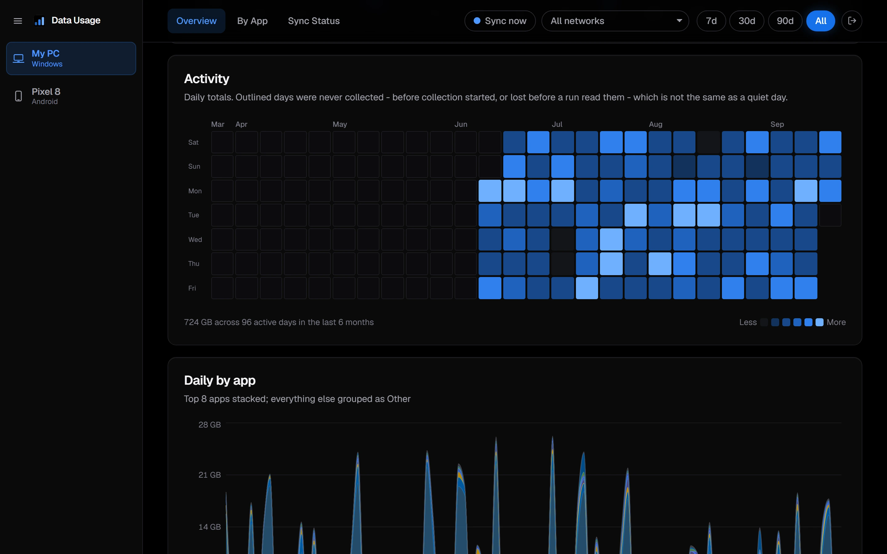
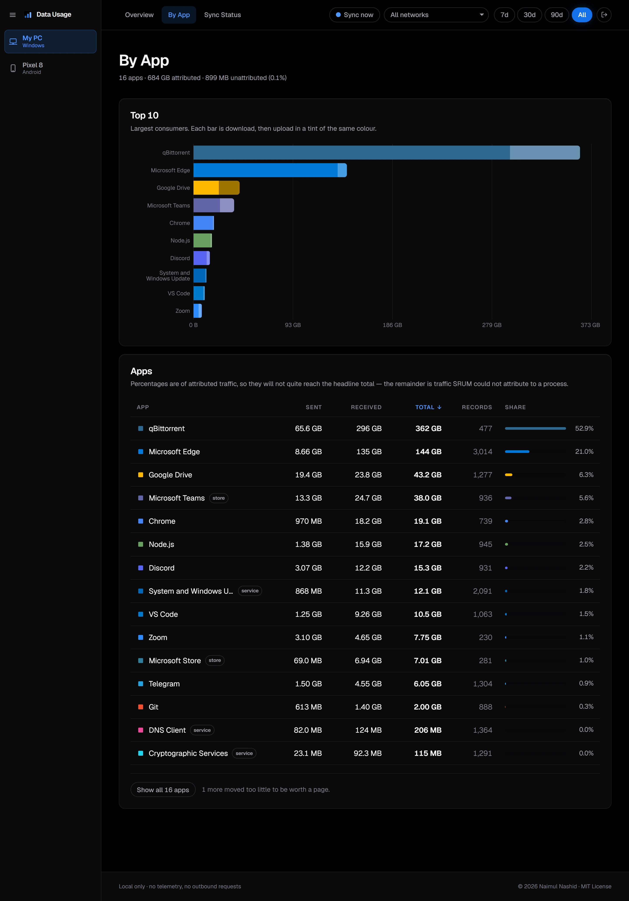
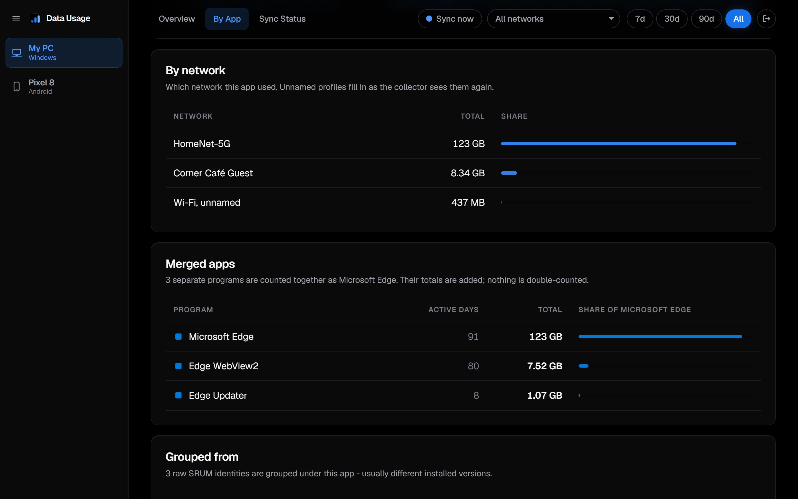
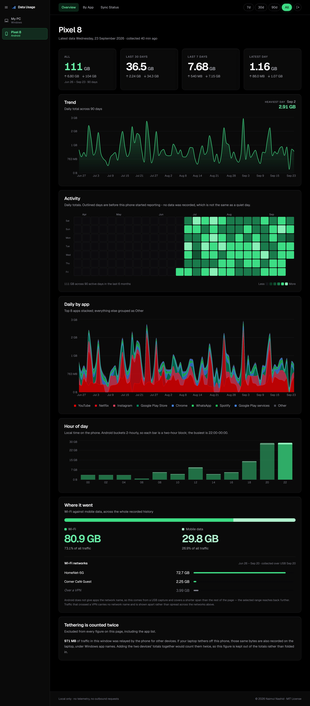
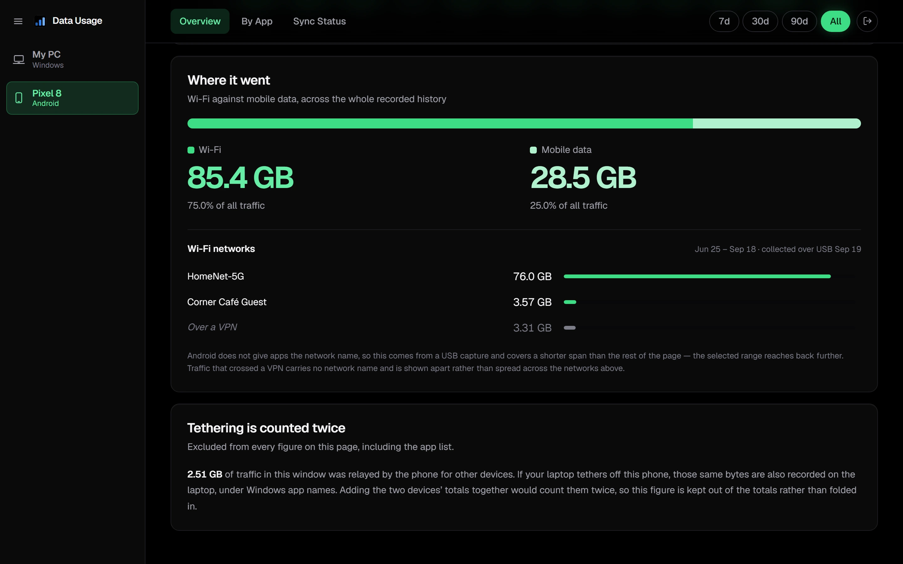

# Data Usage Tracker

A local dashboard that makes per-app network usage history **permanent**, for a
Windows PC and, optionally, Android phones.

Windows already tracks how much data each app uses (Settings → Network &
internet → Data usage), but it keeps only about 30 to 60 days, in a database on
the OS partition. **A Windows reset wipes it.** Android keeps about 90 days, and
only an app on the device can read it per app.

This project copies both into a SQLite database on a drive that survives a
reset, and shows them in a Next.js dashboard that runs on your own machine.

- **Local only.** No cloud service, no account, no telemetry, no outbound
  requests. The dashboard listens on `127.0.0.1` unless you open it to your
  network.
- **Windows 10/11.** The collector reads SRUM, the database behind Windows' own
  Data usage page.
- **A personal tool, shared as is.** It is built and used on one machine, and
  depends on Windows internals and a third-party parser. Expect to read the
  scripts before trusting them with your data.



<details>
<summary><b>The heat map, every app, one app in detail, and a phone</b></summary>

A six-month heat map, then each day split by app. Outlined days were never
collected, which is not the same as a quiet day.



Every app, ranked. Each bar is download, then upload in a tint of the app's
own colour.



One app in detail: the networks it used, named as the collector sees them
and "unnamed" until it has, and the separate programs merged into it.



A phone, in its own accent.



Where the phone's traffic went, per Wi-Fi network, with tethering kept apart:
the laptop has already counted those bytes.



</details>

> **Every number in these images is invented.** They are captured from
> `npm run demo:data`, a synthetic history loaded through the real collector and
> phone code; see [Trying it without your own data](#trying-it-without-your-own-data).
> No logos ship, so apps show their colour swatch, as they will on a fresh
> install until you add some.

---

## How it works

```
Task Scheduler, daily 03:30 (not elevated)
        │
        ├─ 1. esentutl /vss  →  shadow-copy the locked SRUDB.dat
        │                       (the one elevated step, run by its own task)
        ├─ 2. esentutl /r    →  replay its journals so it can be read
        ├─ 3. SrumECmd       →  parse the copy to CSV
        ├─ 4. ingest         →  append only new rows to SQLite
        └─ 5. backup()       →  a consistent single-file copy beside it
                    │
                    ▼
   D:\DataUsage\                        ← any drive but C:, so a reset cannot touch it
        live\data-usage.db               the working database
        data-usage.db                    the backup: restore from this one
                    │
                    ▼
   Next.js dashboard, http://localhost:7843   ← starts at logon, password-gated
```

The phone half is optional and independent:

```
Data Usage Reporter (Android app, every 6 hours, on unmetered networks)
        │
        ├─ NetworkStatsManager.querySummary  →  per-uid traffic buckets
        ├─ PackageManager                    →  uid → package → app name
        └─ POST /api/android/ingest          →  bearer token, gzipped
                    │
                    ▼
   the same database, in its own tables
```

The phone app reads Android's public `NetworkStatsManager` API rather than
parsing `adb` output, because the raw dump counts every byte that crossed a VPN
twice. It has no dependencies at all.

The reasoning behind all of this, including the traps that shaped it (SRUM's
per-interface total row that doubles every naive sum, the journal replay a
shadow copy needs, why the Android dedup rule is the opposite of the Windows
one), is in **[docs/DESIGN.md](docs/DESIGN.md)**.

## Requirements

- **Windows 10 or 11**, and **Administrator rights once**, to register the
  scheduled tasks. Only the shadow copy runs elevated, from an admin-owned copy
  of one small script; the collector and the dashboard run as you.
- **Node.js 22.16 or newer** (developed on Node 24). The database is Node's
  built-in `node:sqlite`, so there is no native build step.
- **[SrumECmd](https://ericzimmerman.github.io/)**, downloaded yourself; it is
  not bundled or fetched automatically. It needs a **.NET runtime**; if it will
  not start on the one you have, set `DOTNET_ROLL_FORWARD=Major`.
- **A second drive or partition** for the database. It must not be on `C:\`;
  the collector refuses.

For the phone (optional):

- **Android 8.0 or newer** (`minSdk` 26, `targetSdk` 36).
- **A JDK and the Android SDK** to build the app, and **adb** to install it.

---

## Setup

### 1. Install and configure

```bash
npm install
```

Edit [config/collector.json](config/collector.json):

| Key | What it is |
|---|---|
| `databasePath` | The working database. **Not on `C:\`.** |
| `backupPath` | The consistent backup, next to it. This is what you restore from. |
| `scratchDir` | A working folder for the ~99 MB snapshot and CSVs mid-run. Keep it outside any cloud-synced folder, or every run uploads your raw history. |
| `srumECmdDir` | The folder holding `SrumECmd.exe`. |
| `deviceLabel` | What the dashboard calls this machine; also its URL (`/windows/<slug>`). |
| `splitApp` | Optional. One app, as the dashboard names it (for example `"qBittorrent"`), to show against everything else on the Overview, for a machine where one app dwarfs the rest. `null` for none. |

If you want an offsite copy, point a sync client (OneDrive, Google Drive and so
on) at the folder holding `backupPath`.

### 2. Set a password

Copy [.env.example](.env.example) to `.env.local` and set a password of **at
least 12 characters**:

```bash
DASHBOARD_PASSWORD=choose-something-long
```

The dashboard shows which programs run on this machine and when, so it is
gated, and **it fails closed**: with no password, or a short one, it refuses
every request. Wrong guesses are throttled. Changing the password signs out
every device.

By default the dashboard answers only on `127.0.0.1`. To reach it from another
device, which the phone app needs, add `DASHBOARD_HOST=0.0.0.0` to `.env.local`
and allow Node.js through Windows Firewall on **Private** networks only. It is
plain HTTP behind this password, so keep it off networks you do not trust.

### 3. Register the tasks, and collect

From an **Administrator PowerShell**, once:

```bash
powershell -ExecutionPolicy Bypass -File scripts\register-task.ps1 -RunNow
```

This registers two tasks and runs a first collection:

- **Data Usage Collector**: daily at 03:30, catching up if the machine was off.
  It runs **unelevated**: it parses, ingests, backs up and cleans up.
- **Data Usage Snapshot**: elevated, on demand, and started only by the
  collector. It takes the shadow copy of the locked SRUM database and nothing
  else. It runs a copy of `scripts\srum-snapshot.ps1` that registration places in
  `%ProgramData%\DataUsageTracker`, where only administrators can write, never
  the repo's copy. **After editing that script, re-run this command.**

It also writes both task definitions to `scripts\task\` as a record. They
contain your Windows account ID and paths, so they are git-ignored; keep them
with your backups rather than in a public fork.

After this, a collection needs no elevation, from any shell. It is safe to
re-run; a second pass over the same window inserts nothing:

```bash
powershell -ExecutionPolicy Bypass -File scripts\collector.ps1
```

### 4. Start the dashboard at logon

```bash
powershell -ExecutionPolicy Bypass -File scripts\install-autostart.ps1
```

This registers a logon task that starts the dashboard hidden, so
<http://localhost:7843> is simply there. No admin rights needed. It also
registers a small task that notes which Wi-Fi network you are on every 15
minutes, which is how network profiles get their names. To start the dashboard
now:

```bash
wscript scripts\dashboard-hidden.vbs
```

**Build after changing anything it serves.** The launcher builds only when there
is no build at all; otherwise it serves what is on disk, and
`logs\dashboard.log` warns when that is older than the source:

```bash
npm run build
```

### 5. Add an Android phone (optional)

Set a second secret in `.env.local`. It is separate from the password, so the
dashboard password never lives on a phone:

```bash
ANDROID_INGEST_TOKEN=another-long-random-string
```

Make sure `DASHBOARD_HOST=0.0.0.0` is set (step 2), then build and install the
app:

```bash
cd android && .\gradlew.bat assembleDebug
```

```bash
adb install -r android\app\build\outputs\apk\debug\app-debug.apk
```

Gradle needs a JDK; Android Studio's bundled one works as `JAVA_HOME`. On
Xiaomi's MIUI, `adb install` is refused unless Developer options → **Install via
USB** is on; without that, `adb push` the APK to the phone and install it from
the file manager.

On the phone, open **Data Usage Reporter** and:

1. Enter the dashboard address and the token, then **Save and test
   connection**. Use this PC's LAN address (`ipconfig` shows it, for example
   `http://192.168.1.20:7843`), not `localhost`, which on a phone is the phone.
2. Press **Grant usage access** and switch it on in Settings. Android never
   prompts for this, and without it the app silently reports only its own
   traffic.
3. **Android 9 and older:** press **Grant phone permission**. Those versions
   read mobile data per SIM, which needs it; the app will not sync without it
   rather than silently record no mobile data.
4. Press **Sync now** once, then leave it. It syncs every 6 hours on unmetered
   networks; both are adjustable in the app.

**Never add a phone's total to the PC's.** Tethering (uid `-5`) is traffic the
phone relayed for other devices; if this PC tethers off the phone, those bytes
are in both. The dashboard keeps tethering out of the phone's totals.

Per-network phone traffic is not available to apps; `npm run android:ssid` reads
it over USB when you want it.

---

## Using it

| Page | Shows |
|---|---|
| **Overview** | All / 30 days / 7 days / latest day, the daily trend, a six-month heat map, daily usage by app, hour of day |
| **By App** | Every app with enough activity for a detail page, expandable to every app seen |
| **App detail** | One app's daily and hourly usage, networks, and which programs were grouped into it |
| **Sync Status** | Collector run history, with warnings when it has stopped |
| **Phone pages** | The same views for each phone, plus per-network (SSID) traffic |

The date range and network live in the URL, so every view is linkable, for
example `/windows/my-pc/apps?days=90&profile=268435457`. **Sync now** in the top
bar runs a collection on demand.

**Totals will not match Windows' page exactly, and that is expected.** Windows
scopes its page to one network; the dashboard defaults to all of them. Pick a
network in the top bar to compare like for like.

**Watch Sync Status.** Surviving a reset depends on the collector actually
running; that page is where you notice it has stopped.

### Everyday commands

| | |
|---|---|
| Report from the command line | `npm run stats` (add `-- --profile <id>` to scope) |
| Development server | `npm run dev` |
| Stop the dashboard | `powershell -ExecutionPolicy Bypass -File scripts\dashboard-stop.ps1` |
| Turn off autostart | `powershell -ExecutionPolicy Bypass -File scripts\install-autostart.ps1 -Remove` |
| Remove the collector tasks | `powershell -ExecutionPolicy Bypass -File scripts\register-task.ps1 -Unregister` (Administrator) |
| Self-test (no admin, no real data) | `npm run selftest` |
| Typecheck | `npm run typecheck` |
| Rehearse a reset recovery | `npm run drill` (add `-- --full` to also test `npm ci`) |
| Logs | `logs\collector-*.log`, `logs\dashboard.log` |

---

## Trying it without your own data

```bash
npm run demo:data
```

Writes a synthetic history to `./demo-data` (git-ignored): 100 days of an
invented PC and 90 of an invented phone. It is not a mock. The PC's history is
written as SrumECmd CSVs and loaded by the real `ingest.ts`, one simulated
collector run at a time, and the phone's goes through the real ingest code, so
every number is computed the way yours would be. It reproduces the awkward
parts of real data on purpose: SRUM's per-interface total rows, apps split
across versioned install paths, overlapping collector runs, networks named by
observation, and tethering that both devices count.

To browse it, start a second dashboard pointed at it. `DATA_USAGE_CONFIG` is
read by the dashboard only; your own database and collector are untouched.

```powershell
npm run build
$env:DATA_USAGE_CONFIG = "$PWD\demo-data\collector.json"
$env:NEXT_TELEMETRY_DISABLED = '1'
npx next start -H 127.0.0.1 -p 7899
```

Sign in with your usual password, then open <http://127.0.0.1:7899/windows/my-pc>.

**The screenshots above come from that data**, and are regenerated rather than
edited by hand:

```bash
npm run demo:shots
```

It starts its own dashboard on the demo data with a one-off password, captures
six pages in headless Chrome or Edge into `docs/screenshots/`, and stops it.
It needs a current build, and it refuses to capture any page that lists a
device other than the demo's two. That way a build that ignored
`DATA_USAGE_CONFIG` cannot put your own data into an image.

---

## Recovery after a Windows reset

A reset erases `C:\`: the repo, Node, SrumECmd, SRUM itself and the scheduled
tasks. Your database drive survives. Rehearse the whole recovery at any time,
without resetting anything, with `npm run drill`.

1. Install [Node.js](https://nodejs.org), [Git](https://git-scm.com),
   [SrumECmd](https://ericzimmerman.github.io/) and a .NET runtime.
2. Check your database folder is intact. If you synced it offsite, let it sync
   back down first.
3. Clone this repo anywhere, then `npm install`, and restore
   `config/collector.json` if you had changed it.
4. Restore the database from the backup:

   ```bash
   npm run restore
   ```

   This copies the backup over the working database, never the reverse, moving
   any existing database aside and clearing stale `-wal`/`-shm` files first.
5. Recreate `.env.local`. **If you use the phone app, restore
   `ANDROID_INGEST_TOKEN` to its old value**; the phone has the old one, and
   otherwise stops syncing without saying so here.
6. Re-register the tasks, the collector pair from an Administrator PowerShell,
   the dashboard from a normal one. Re-run the scripts rather than importing
   the saved XML: that XML names the old install's account, and the snapshot
   script has to be redeployed.

   ```bash
   powershell -ExecutionPolicy Bypass -File scripts\register-task.ps1 -RunNow
   ```

   ```bash
   powershell -ExecutionPolicy Bypass -File scripts\install-autostart.ps1
   ```

7. Check with `npm run stats`, then open <http://localhost:7843>.

SRUM starts empty on a fresh install. Your history comes from the restored
database, and the collector appends to it from there.

---

## Security and privacy

- **What it exposes:** the dashboard serves your per-app usage history. It
  listens on `127.0.0.1` unless you set `DASHBOARD_HOST`, and every page and API
  route is behind the password. There are no default credentials.
- **Privileges:** only the shadow-copy step runs as Administrator, from a
  folder only administrators can write, and it checks that folder every run.
  See [docs/DESIGN.md](docs/DESIGN.md#the-privilege-split).
- **Data never leaves the machine**, except to your phone's own dashboard
  address and any sync client you point at the backup yourself. Next.js
  telemetry is disabled.
- **Nothing collected is ever committed**: `.gitignore` blocks databases,
  snapshots and CSVs.

To report a vulnerability, see [SECURITY.md](SECURITY.md).

## Contributing

Issues and pull requests are welcome; see [CONTRIBUTING.md](CONTRIBUTING.md).
Please do not include your own usage data, device names or network names in
reports.

## License

[MIT](LICENSE)
